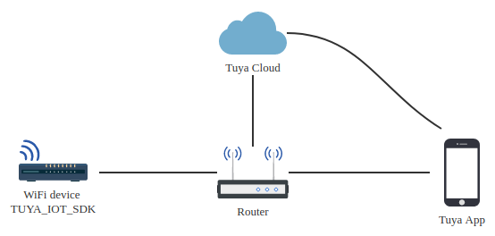

# TUYA_IOT_SDK 接入指南

TUYA_IOT_SDK基于linux系统的硬件设备和涂鸦云通信的接口封装，加速应用开发过程，主要包括了以下功能：

- 提供符合涂鸦标准数据规范的上下行通道：控制指令下发、状态上报、扫地机地图数据上报
- 设备配网支持(AP配网和EZ配网)
- 提供涂鸦标准化服务：设备固件OTA升级、本地定时等
- github仓库地址：https://github.com/TuyaInc/TUYA_IOT_SDK.git

## 功能概述
1.2.1 定义
直接与涂鸦云、涂鸦app建立通信链路并进行涂鸦标准数据交互的一个软件中间件。
1.2.2 功能描述
- 提供符合涂鸦标准数据规范的上下行通道
- 提供数据过滤服务：数据校验、规则上报、上报频率控制等
- 提供涂鸦标准化服务，例如本地定时、本地联动等功能
- 通信传输过程中的数据安全服务

## 文档使用者

本文档主要基于wifi设备接入涂鸦云的说明；

WiFi设备指设备使用WiFi连接网络，并继而与涂鸦云物联网通信的设备：

