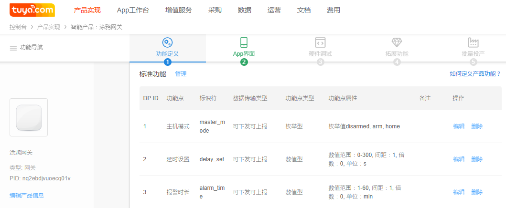

## 创建网关产品

- 登陆注册涂鸦开发者平台：https://iot.tuya.com/index
- 如何快速创建产品：https://docs.tuya.com/cn/product/creatproduct.html

- 创建步骤：

1. 创建产品 -> 其他 -> 自定义 -> 网关，如下图左，会生成一个PID（网关产品key）；

    右边为标准功能点定义，用户可以根据需求删改，删改时可能无法兼容App界面里的模板，需要联系商务定制
   
2. 功能定义(dp点)说明
    设备和涂鸦云，涂鸦APP控制数据通信协议采用dp数据格式，实际数据传输基于mqtt协议；不适用于大数据高频数据传输。

    参考：https://docs.tuya.com/cn/product/function.html

    SDK开发方式时，RAW型和String型单包数据长度小于1K;

    接口具体使用参考：[设备控制](control.md)

